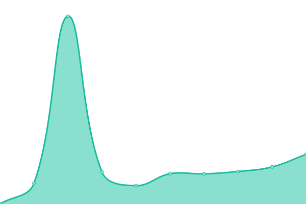
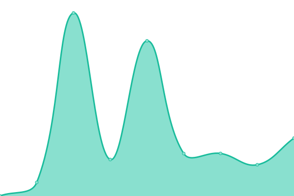
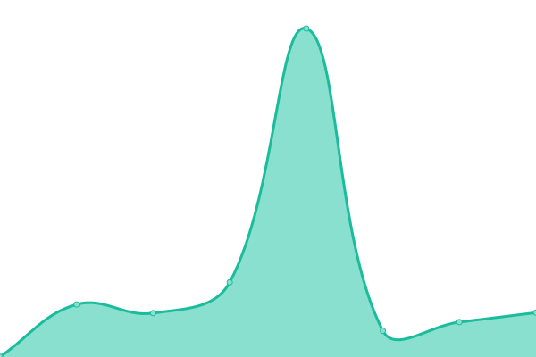
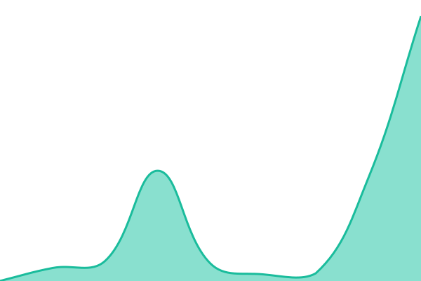
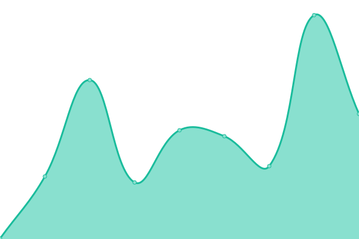
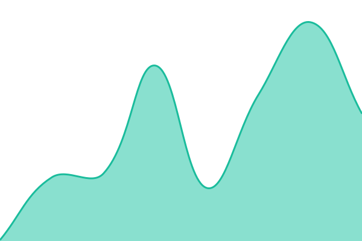
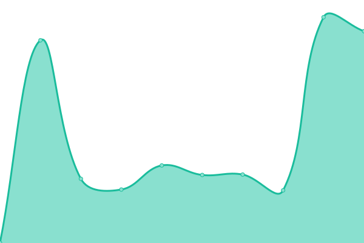
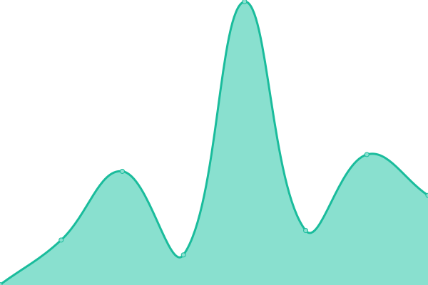
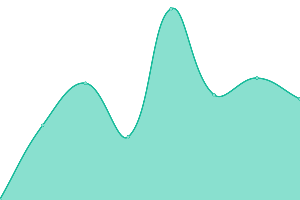
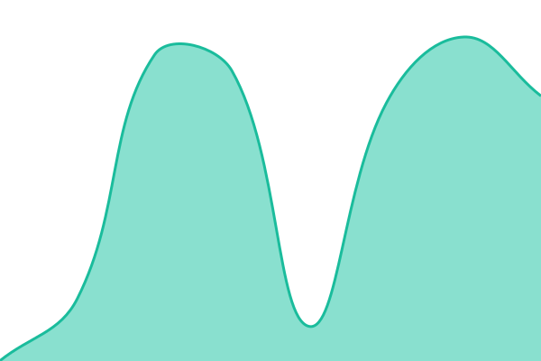

# [📈 Live Status](https://status.elizabethannstein.com): <!--live status--> **🟧 Partial outage**

This repository contains the open-source uptime monitor and status page for [Elizabeth Stein](https://www.elizabethannstein.com), powered by [Upptime](https://github.com/upptime/upptime).

With [Upptime](https://upptime.js.org), you can get your own unlimited and free uptime monitor and status page, powered entirely by a GitHub repository. We use [Issues](https://github.com/forbiddenlink/upptime/issues) as incident reports, [Actions](https://github.com/forbiddenlink/upptime/actions) as uptime monitors, and [Pages](https://status.elizabethannstein.com) for the status page.

<!--start: status pages-->
<!-- This summary is generated by Upptime (https://github.com/upptime/upptime) -->
<!-- Do not edit this manually, your changes will be overwritten -->
<!-- prettier-ignore -->
| URL | Status | History | Response Time | Uptime |
| --- | ------ | ------- | ------------- | ------ |
|  [MyAquaLog](https://myaqualog.com) | 🟩 Up | [my-aqua-log.yml](https://github.com/forbiddenlink/upptime/commits/HEAD/history/my-aqua-log.yml) | 

 196ms
     
 | 

<a href="https://status.elizabethannstein.com/history/my-aqua-log">100.00%</a>
    

|  [Hire Ready](https://imhireready.com) | 🟩 Up | [hire-ready.yml](https://github.com/forbiddenlink/upptime/commits/HEAD/history/hire-ready.yml) | 

 275ms
     
 | 

<a href="https://status.elizabethannstein.com/history/hire-ready">94.08%</a>
    

|  [Testimoniq](https://testimoniq.com) | 🟩 Up | [testimoniq.yml](https://github.com/forbiddenlink/upptime/commits/HEAD/history/testimoniq.yml) | 

 244ms
     
 | 

<a href="https://status.elizabethannstein.com/history/testimoniq">100.00%</a>
    

|  [ExplainThisCode](https://explainthiscode.ai) | 🟩 Up | [explain-this-code.yml](https://github.com/forbiddenlink/upptime/commits/HEAD/history/explain-this-code.yml) | 

 312ms
     
 | 

<a href="https://status.elizabethannstein.com/history/explain-this-code">100.00%</a>
    

|  [UCP Guard](https://ucpguard.com) | 🟩 Up | [ucp-guard.yml](https://github.com/forbiddenlink/upptime/commits/HEAD/history/ucp-guard.yml) | 

 290ms
     
 | 

<a href="https://status.elizabethannstein.com/history/ucp-guard">100.00%</a>
    

|  [AutomaDocs](https://automadocs.com) | 🟩 Up | [automa-docs.yml](https://github.com/forbiddenlink/upptime/commits/HEAD/history/automa-docs.yml) | 

 261ms
     
 | 

<a href="https://status.elizabethannstein.com/history/automa-docs">100.00%</a>
    

|  [AutomaDocs API](https://api.automadocs.com/health) | 🟩 Up | [automa-docs-api.yml](https://github.com/forbiddenlink/upptime/commits/HEAD/history/automa-docs-api.yml) | 

 959ms
     
 | 

<a href="https://status.elizabethannstein.com/history/automa-docs-api">100.00%</a>
    

|  [AutomaDocs OG Images](https://automadocs.com/api/og?title=AutomaDocs) | 🟩 Up | [automa-docs-og-images.yml](https://github.com/forbiddenlink/upptime/commits/HEAD/history/automa-docs-og-images.yml) | 

 1199ms
     
 | 

<a href="https://status.elizabethannstein.com/history/automa-docs-og-images">100.00%</a>
    

|  [AutomaDocs Public Sitemap](https://api.automadocs.com/api/public/sitemap) | 🟩 Up | [automa-docs-public-sitemap.yml](https://github.com/forbiddenlink/upptime/commits/HEAD/history/automa-docs-public-sitemap.yml) | 

 757ms
     
 | 

<a href="https://status.elizabethannstein.com/history/automa-docs-public-sitemap">100.00%</a>
    

|  [AutomaDocs Demo](https://automadocs.com/demo) | 🟩 Up | [automa-docs-demo.yml](https://github.com/forbiddenlink/upptime/commits/HEAD/history/automa-docs-demo.yml) | 

 199ms
     
 | 

<a href="https://status.elizabethannstein.com/history/automa-docs-demo">100.00%</a>
    

|  [AutomaDocs Dependency Health](https://api.automadocs.com/api/dependencies/health?strict=1) | 🟥 Down | [automa-docs-dependency-health.yml](https://github.com/forbiddenlink/upptime/commits/HEAD/history/automa-docs-dependency-health.yml) | 

 1222ms
     
 | 

<a href="https://status.elizabethannstein.com/history/automa-docs-dependency-health">37.47%</a>
    

|  [AutomaDocs AI Budget](https://api.automadocs.com/api/spend/budget) | 🟩 Up | [automa-docs-ai-budget.yml](https://github.com/forbiddenlink/upptime/commits/HEAD/history/automa-docs-ai-budget.yml) | 

 764ms
     
 | 

<a href="https://status.elizabethannstein.com/history/automa-docs-ai-budget">100.00%</a>
    

|  [Mistria Companion](https://mistriacompanion.com) | 🟩 Up | [mistria-companion.yml](https://github.com/forbiddenlink/upptime/commits/HEAD/history/mistria-companion.yml) | 

 122ms
     
 | 

<a href="https://status.elizabethannstein.com/history/mistria-companion">100.00%</a>
    

|  [Portfolio](https://elizabethannstein.com) | 🟩 Up | [portfolio.yml](https://github.com/forbiddenlink/upptime/commits/HEAD/history/portfolio.yml) | 

 105ms
     
 | 

<a href="https://status.elizabethannstein.com/history/portfolio">100.00%</a>
    

|  [Mythos Atlas](https://mythosatlas.com) | 🟩 Up | [mythos-atlas.yml](https://github.com/forbiddenlink/upptime/commits/HEAD/history/mythos-atlas.yml) | 

 625ms
     
 | 

<a href="https://status.elizabethannstein.com/history/mythos-atlas">100.00%</a>
    

|  [GoodShape](https://goodshape.app) | 🟩 Up | [good-shape.yml](https://github.com/forbiddenlink/upptime/commits/HEAD/history/good-shape.yml) | 

 869ms
     
 | 

<a href="https://status.elizabethannstein.com/history/good-shape">100.00%</a>
    

|  [Rocket Vitals](https://rocketvitals.com) | 🟩 Up | [rocket-vitals.yml](https://github.com/forbiddenlink/upptime/commits/HEAD/history/rocket-vitals.yml) | 

 375ms
     
 | 

<a href="https://status.elizabethannstein.com/history/rocket-vitals">98.80%</a>
    

|  [Portfolio Pro](https://portfoliopro.dev) | 🟩 Up | [portfolio-pro.yml](https://github.com/forbiddenlink/upptime/commits/HEAD/history/portfolio-pro.yml) | 

 536ms
     
 | 

<a href="https://status.elizabethannstein.com/history/portfolio-pro">100.00%</a>
    

|  [Finance Quest](https://financequest.fyi) | 🟩 Up | [finance-quest.yml](https://github.com/forbiddenlink/upptime/commits/HEAD/history/finance-quest.yml) | 

 709ms
     
 | 

<a href="https://status.elizabethannstein.com/history/finance-quest">100.00%</a>
    

|  [Create Surveys](https://create-surveys.com) | 🟩 Up | [create-surveys.yml](https://github.com/forbiddenlink/upptime/commits/HEAD/history/create-surveys.yml) | 

 307ms
     
 | 

<a href="https://status.elizabethannstein.com/history/create-surveys">100.00%</a>
    

|  [Rootwrecker](https://rootwrecker.com) | 🟩 Up | [rootwrecker.yml](https://github.com/forbiddenlink/upptime/commits/HEAD/history/rootwrecker.yml) | 

 212ms
     
 | 

<a href="https://status.elizabethannstein.com/history/rootwrecker">100.00%</a>
    

<!--end: status pages-->

[**Visit our status website →**](https://status.elizabethannstein.com)

## 📄 License

- Powered by: [Upptime](https://github.com/upptime/upptime)
- Code: [MIT](./LICENSE) © [Anand Chowdhary](https://anandchowdhary.com), supported by [Pabio](https://pabio.com)
- Data in the `./history` directory: [Open Database License](https://opendatacommons.org/licenses/odbl/1-0/)
