# [📈 Live Status](https://status.elizabethannstein.com): <!--live status--> **🟧 Partial outage**

This repository contains the open-source uptime monitor and status page for [Elizabeth Stein](https://www.elizabethannstein.com), powered by [Upptime](https://github.com/upptime/upptime).

With [Upptime](https://upptime.js.org), you can get your own unlimited and free uptime monitor and status page, powered entirely by a GitHub repository. We use [Issues](https://github.com/forbiddenlink/upptime/issues) as incident reports, [Actions](https://github.com/forbiddenlink/upptime/actions) as uptime monitors, and [Pages](https://status.elizabethannstein.com) for the status page.

<!--start: status pages-->
<!-- This summary is generated by Upptime (https://github.com/upptime/upptime) -->
<!-- Do not edit this manually, your changes will be overwritten -->
<!-- prettier-ignore -->
| URL | Status | History | Response Time | Uptime |
| --- | ------ | ------- | ------------- | ------ |
|  [MyAquaLog](https://myaqualog.com) | 🟩 Up | [my-aqua-log.yml](https://github.com/forbiddenlink/upptime/commits/HEAD/history/my-aqua-log.yml) | 

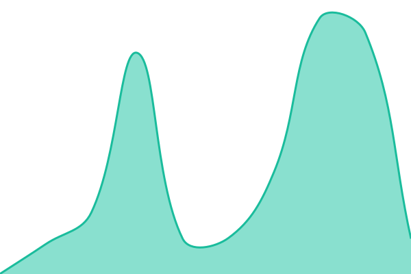 756ms
     
 | 

<a href="https://status.elizabethannstein.com/history/my-aqua-log">100.00%</a>
    

|  [StoryVision](https://storyvision.vercel.app) | 🟩 Up | [story-vision.yml](https://github.com/forbiddenlink/upptime/commits/HEAD/history/story-vision.yml) | 

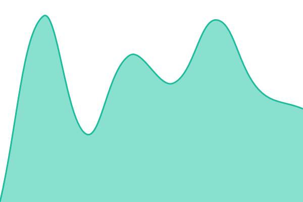 714ms
     
 | 

<a href="https://status.elizabethannstein.com/history/story-vision">100.00%</a>
    

|  [Hire Ready](https://imhireready.com) | 🟩 Up | [hire-ready.yml](https://github.com/forbiddenlink/upptime/commits/HEAD/history/hire-ready.yml) | 

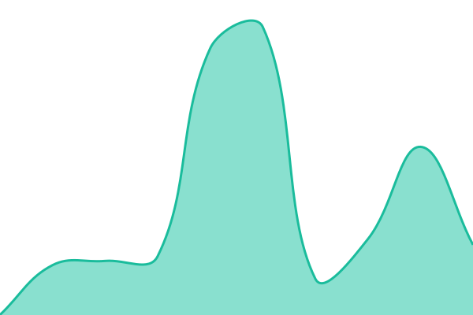 740ms
     
 | 

<a href="https://status.elizabethannstein.com/history/hire-ready">100.00%</a>
    

|  [Testimoniq](https://testimoniq.com) | 🟩 Up | [testimoniq.yml](https://github.com/forbiddenlink/upptime/commits/HEAD/history/testimoniq.yml) | 

 706ms
     
 | 

<a href="https://status.elizabethannstein.com/history/testimoniq">100.00%</a>
    

|  [ExplainThisCode](https://explainthiscode.ai) | 🟩 Up | [explain-this-code.yml](https://github.com/forbiddenlink/upptime/commits/HEAD/history/explain-this-code.yml) | 

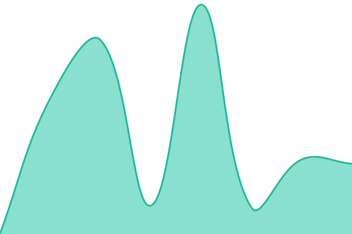 575ms
     
 | 

<a href="https://status.elizabethannstein.com/history/explain-this-code">100.00%</a>
    

|  [UCP Guard](https://ucpguard.com) | 🟩 Up | [ucp-guard.yml](https://github.com/forbiddenlink/upptime/commits/HEAD/history/ucp-guard.yml) | 

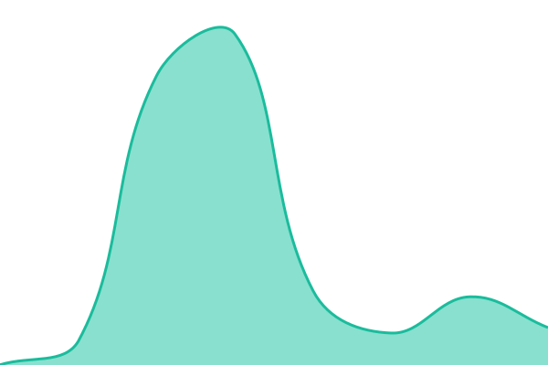 418ms
     
 | 

<a href="https://status.elizabethannstein.com/history/ucp-guard">100.00%</a>
    

|  [AutomaDocs](https://automadocs.com) | 🟩 Up | [automa-docs.yml](https://github.com/forbiddenlink/upptime/commits/HEAD/history/automa-docs.yml) | 

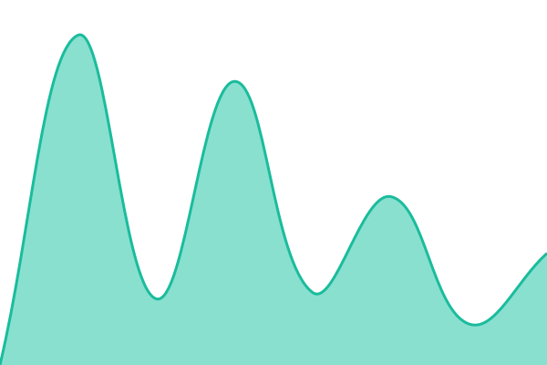 803ms
     
 | 

<a href="https://status.elizabethannstein.com/history/automa-docs">100.00%</a>
    

|  [AutomaDocs API](https://api.automadocs.com/health) | 🟩 Up | [automa-docs-api.yml](https://github.com/forbiddenlink/upptime/commits/HEAD/history/automa-docs-api.yml) | 

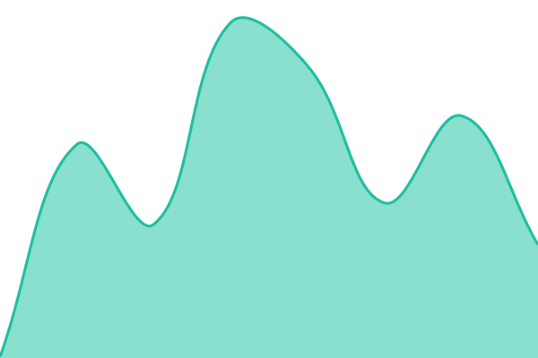 178ms
     
 | 

<a href="https://status.elizabethannstein.com/history/automa-docs-api">100.00%</a>
    

|  [AutomaDocs OG Images](https://automadocs.com/api/og?title=AutomaDocs) | 🟩 Up | [automa-docs-og-images.yml](https://github.com/forbiddenlink/upptime/commits/HEAD/history/automa-docs-og-images.yml) | 

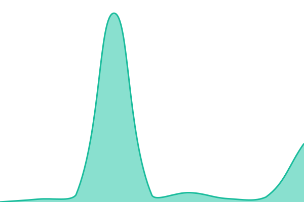 874ms
     
 | 

<a href="https://status.elizabethannstein.com/history/automa-docs-og-images">100.00%</a>
    

|  [AutomaDocs Public Sitemap](https://api.automadocs.com/api/public/sitemap) | 🟩 Up | [automa-docs-public-sitemap.yml](https://github.com/forbiddenlink/upptime/commits/HEAD/history/automa-docs-public-sitemap.yml) | 

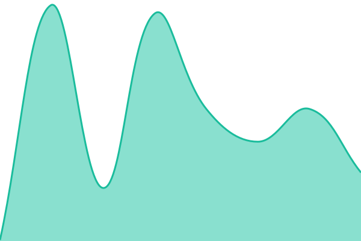 117ms
     
 | 

<a href="https://status.elizabethannstein.com/history/automa-docs-public-sitemap">100.00%</a>
    

|  [AutomaDocs Demo](https://automadocs.com/demo) | 🟩 Up | [automa-docs-demo.yml](https://github.com/forbiddenlink/upptime/commits/HEAD/history/automa-docs-demo.yml) | 

 250ms
     
 | 

<a href="https://status.elizabethannstein.com/history/automa-docs-demo">100.00%</a>
    

|  [AutomaDocs Dependency Health](https://api.automadocs.com/api/dependencies/health) | 🟩 Up | [automa-docs-dependency-health.yml](https://github.com/forbiddenlink/upptime/commits/HEAD/history/automa-docs-dependency-health.yml) | 

 854ms
     
 | 

<a href="https://status.elizabethannstein.com/history/automa-docs-dependency-health">100.00%</a>
    

|  [AutomaDocs AI Budget](https://api.automadocs.com/api/spend/budget) | 🟩 Up | [automa-docs-ai-budget.yml](https://github.com/forbiddenlink/upptime/commits/HEAD/history/automa-docs-ai-budget.yml) | 

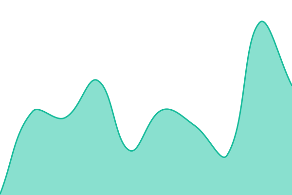 114ms
     
 | 

<a href="https://status.elizabethannstein.com/history/automa-docs-ai-budget">100.00%</a>
    

|  [Portfolio](https://elizabethannstein.com) | 🟩 Up | [portfolio.yml](https://github.com/forbiddenlink/upptime/commits/HEAD/history/portfolio.yml) | 

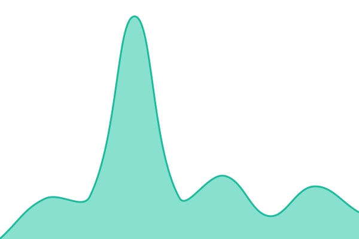 233ms
     
 | 

<a href="https://status.elizabethannstein.com/history/portfolio">100.00%</a>
    

|  [Mythos Atlas](https://mythosatlas.com) | 🟩 Up | [mythos-atlas.yml](https://github.com/forbiddenlink/upptime/commits/HEAD/history/mythos-atlas.yml) | 

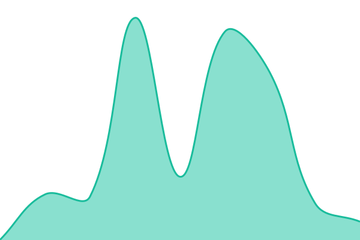 673ms
     
 | 

<a href="https://status.elizabethannstein.com/history/mythos-atlas">100.00%</a>
    

|  [GoodShape](https://goodshape.app) | 🟩 Up | [good-shape.yml](https://github.com/forbiddenlink/upptime/commits/HEAD/history/good-shape.yml) | 

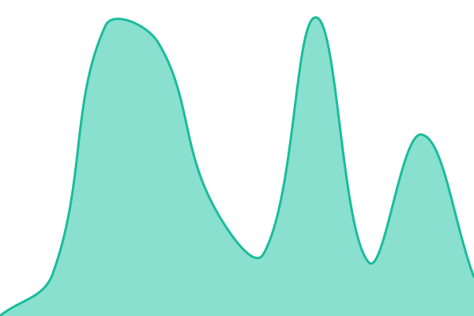 1066ms
     
 | 

<a href="https://status.elizabethannstein.com/history/good-shape">100.00%</a>
    

|  [Rocket Vitals](https://rocketvitals.com) | 🟩 Up | [rocket-vitals.yml](https://github.com/forbiddenlink/upptime/commits/HEAD/history/rocket-vitals.yml) | 

 357ms
     
 | 

<a href="https://status.elizabethannstein.com/history/rocket-vitals">100.00%</a>
    

|  [Portfolio Pro](https://www.portfoliopro.dev/api/health/webhook) | 🟥 Down | [portfolio-pro.yml](https://github.com/forbiddenlink/upptime/commits/HEAD/history/portfolio-pro.yml) | 

 5152ms
     
 | 

<a href="https://status.elizabethannstein.com/history/portfolio-pro">100.00%</a>
    

|  [Finance Quest](https://financequest.fyi) | 🟩 Up | [finance-quest.yml](https://github.com/forbiddenlink/upptime/commits/HEAD/history/finance-quest.yml) | 

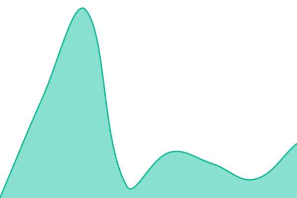 772ms
     
 | 

<a href="https://status.elizabethannstein.com/history/finance-quest">100.00%</a>
    

|  [Create Surveys](https://create-surveys.com) | 🟩 Up | [create-surveys.yml](https://github.com/forbiddenlink/upptime/commits/HEAD/history/create-surveys.yml) | 

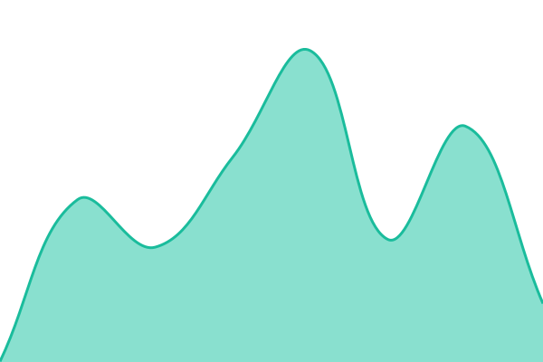 278ms
     
 | 

<a href="https://status.elizabethannstein.com/history/create-surveys">100.00%</a>
    

|  [Nova Particles](https://novaparticles.com) | 🟩 Up | [nova-particles.yml](https://github.com/forbiddenlink/upptime/commits/HEAD/history/nova-particles.yml) | 

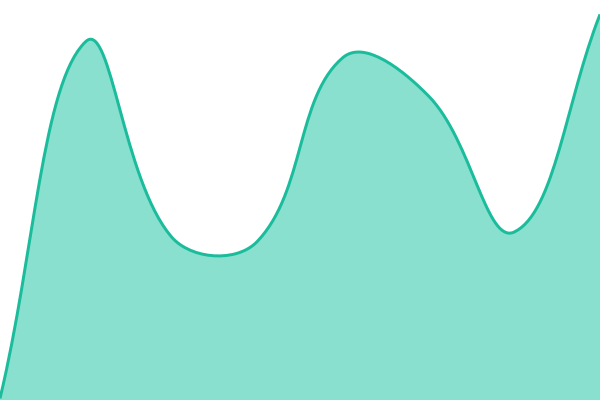 129ms
     
 | 

<a href="https://status.elizabethannstein.com/history/nova-particles">100.00%</a>
    

|  [Personaudit](https://personaudit.com) | 🟩 Up | [personaudit.yml](https://github.com/forbiddenlink/upptime/commits/HEAD/history/personaudit.yml) | 

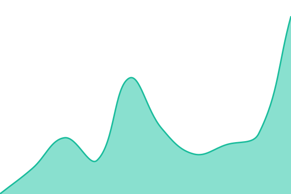 554ms
     
 | 

<a href="https://status.elizabethannstein.com/history/personaudit">100.00%</a>
    

|  [Contradict Me](https://contradict-me.vercel.app) | 🟩 Up | [contradict-me.yml](https://github.com/forbiddenlink/upptime/commits/HEAD/history/contradict-me.yml) | 

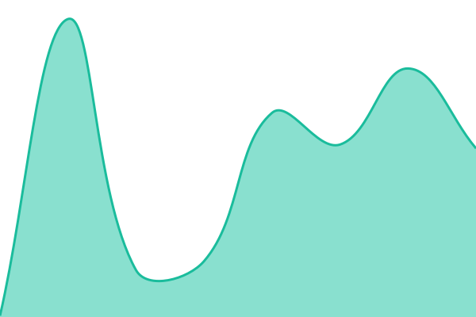 119ms
     
 | 

<a href="https://status.elizabethannstein.com/history/contradict-me">100.00%</a>
    

|  [Canvas Flow](https://canvas-flow.vercel.app) | 🟩 Up | [canvas-flow.yml](https://github.com/forbiddenlink/upptime/commits/HEAD/history/canvas-flow.yml) | 

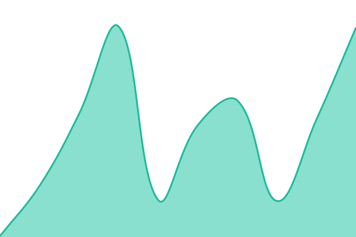 132ms
     
 | 

<a href="https://status.elizabethannstein.com/history/canvas-flow">100.00%</a>
    

|  [CodeCraft Dev](https://codecraft-dev.vercel.app) | 🟩 Up | [code-craft-dev.yml](https://github.com/forbiddenlink/upptime/commits/HEAD/history/code-craft-dev.yml) | 

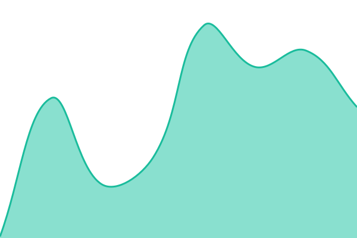 81ms
     
 | 

<a href="https://status.elizabethannstein.com/history/code-craft-dev">100.00%</a>
    

|  [Dare U Radio](https://dareuradio.com) | 🟩 Up | [dare-u-radio.yml](https://github.com/forbiddenlink/upptime/commits/HEAD/history/dare-u-radio.yml) | 

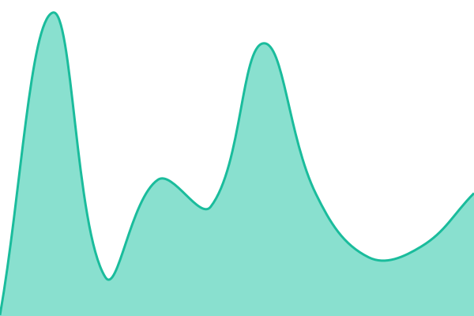 138ms
     
 | 

<a href="https://status.elizabethannstein.com/history/dare-u-radio">100.00%</a>
    

|  [StanceStream](https://stancestream.vercel.app) | 🟩 Up | [stance-stream.yml](https://github.com/forbiddenlink/upptime/commits/HEAD/history/stance-stream.yml) | 

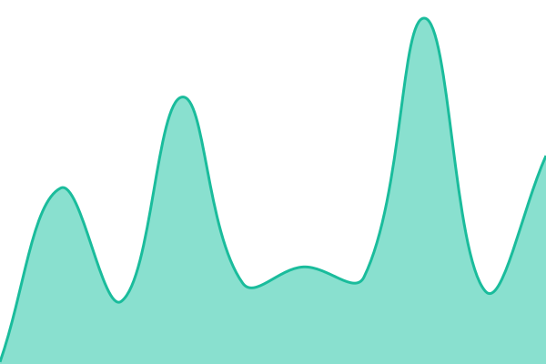 77ms
     
 | 

<a href="https://status.elizabethannstein.com/history/stance-stream">100.00%</a>
    

|  [StanceStream API](https://stancestream.onrender.com/api/health) | 🟩 Up | [stance-stream-api.yml](https://github.com/forbiddenlink/upptime/commits/HEAD/history/stance-stream-api.yml) | 

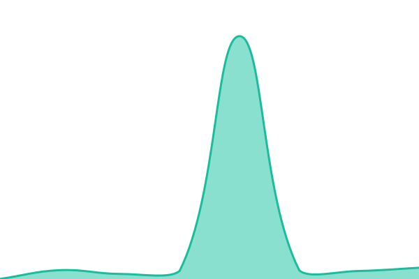 213ms
     
 | 

<a href="https://status.elizabethannstein.com/history/stance-stream-api">100.00%</a>
    

|  [Lumira Gallery](https://lumira-gallery-production.up.railway.app) | 🟩 Up | [lumira-gallery.yml](https://github.com/forbiddenlink/upptime/commits/HEAD/history/lumira-gallery.yml) | 

 208ms
     
 | 

<a href="https://status.elizabethannstein.com/history/lumira-gallery">100.00%</a>
    

|  [Miniflux](https://miniflux.elizabethannstein.com/healthcheck) | 🟩 Up | [miniflux.yml](https://github.com/forbiddenlink/upptime/commits/HEAD/history/miniflux.yml) | 

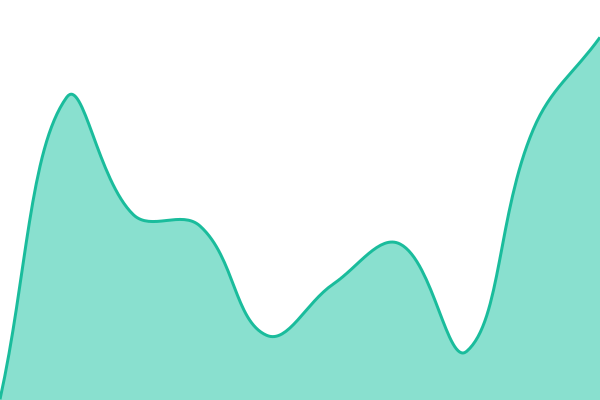 262ms
     
 | 

<a href="https://status.elizabethannstein.com/history/miniflux">100.00%</a>
    

|  [n8n](https://n8n.elizabethannstein.com/healthz) | 🟩 Up | [n8n.yml](https://github.com/forbiddenlink/upptime/commits/HEAD/history/n8n.yml) | 

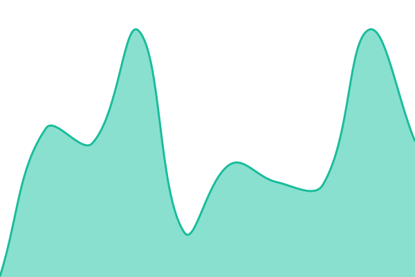 204ms
     
 | 

<a href="https://status.elizabethannstein.com/history/n8n">100.00%</a>
    

|  [CarefulShip](https://carefulship.vercel.app) | 🟩 Up | [careful-ship.yml](https://github.com/forbiddenlink/upptime/commits/HEAD/history/careful-ship.yml) | 

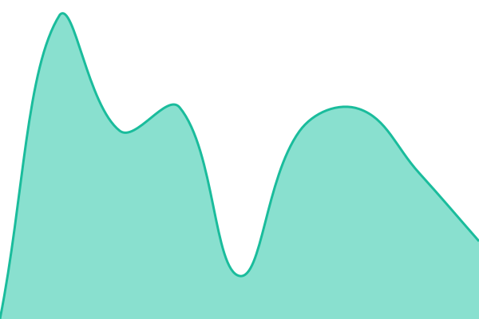 1324ms
     
 | 

<a href="https://status.elizabethannstein.com/history/careful-ship">100.00%</a>
    

|  [Kindred](https://quantum-forge-self.vercel.app) | 🟩 Up | [kindred.yml](https://github.com/forbiddenlink/upptime/commits/HEAD/history/kindred.yml) | 

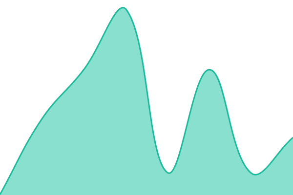 1230ms
     
 | 

<a href="https://status.elizabethannstein.com/history/kindred">100.00%</a>
    

|  [Scripture Lens](https://scripture-lens-fawn.vercel.app) | 🟩 Up | [scripture-lens.yml](https://github.com/forbiddenlink/upptime/commits/HEAD/history/scripture-lens.yml) | 

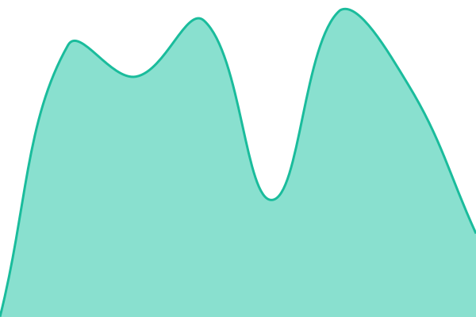 1136ms
     
 | 

<a href="https://status.elizabethannstein.com/history/scripture-lens">100.00%</a>
    

<!--end: status pages-->

[**Visit our status website →**](https://status.elizabethannstein.com)

## 📄 License

- Powered by: [Upptime](https://github.com/upptime/upptime)
- Code: [MIT](./LICENSE) © [Anand Chowdhary](https://anandchowdhary.com), supported by [Pabio](https://pabio.com)
- Data in the `./history` directory: [Open Database License](https://opendatacommons.org/licenses/odbl/1-0/)
